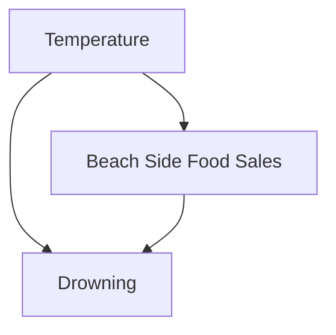

# Who Am I, and Why Should You Listen To Me?

I am Dr. Demetri Pananos. The theme of my career has been causal inference

- Late 2016 Data Analyst Working in A/B Testing
- Late 2017 - Late 2022: PhD in Epidemiology & Biostatistics
- Mid 2022 - Late 2023: Staff Data Scientist at Zapier, lead A/B Testing
- Late 2023 - Late 2024: A foray into Media Mixed Modelling
- Late 2025 - Now: Statistics Engineer at Eppo/Datadog.

Want to share what I've learned here, but first...do we even need causal inference?
# Causal Inference? In this economy?

* Hot take: All business questions are causal.  Sample from my career:
	* *How can we get people to shop at Costco this weekend?*
	* *How can we reduce churn?*
	* *Should we invest in podcast ads?*

* We don't just need data, we need the _right data_
* The _right data_ can be hard to obtain, and without it we can be led astray:
	* Thinking a decision will help when it hurts
	* Thinking a decision will impact a lot when it won't
	* Thinking we are pulling a lever when we aren't

# Causal Inference for Cheap: Randomize

* A/B tests are the easiest way to answer causal questions.
* Much to know!
	* A little math
	* Influencing Teams
	* When you need more math and when you don't
* I want to take you through some of the questions I personally had in my career and the answers I (eventually) came to.  These are hard fought answers I spent months (years sometimes!) discovering, all to you in this lecture.

# First: What Does Randomization Give Us?

- Mackies is a beachside eatery. They also happen to run the life guard program, and hence have data on both food sales and number of times life guards have needed to save a swimmer on a given day.  The data for total sales and number of saves is given in the plot below.  What is this data telling us?
	- Hopefully, "Eating before you swim causes drowning"

* In reality, the relationship is driven by temperature.  When it is hot out, more people go to the beach and buy food.  While at the beach, they go swimming -- but this does not imply that eating before swimming causes incidence of drowning.

# What Happened To Our Inference?

* We would call temperature a "confounder".  A confounder is a common cause of both an exposure (e.g. eating) and an outcome (e.g. risk of drowning)
* This happens all the time in data, and is a major threat to our inferences. For more on confounding, I recommend my blog post "[What is Confounding](https://dpananos.github.io/posts/2024-06-23-confound/)"
* The size of the dataset doesn't help here; we need _the right kind of data_. What is the "right kind", and how can we get it?
* Take home: Correlation is not causation, and any relationship you find in data could be true, could be exaggerated/attenuated, or could be false due to confounding.

# How To Get The Right Kind of Data? Randomize!

